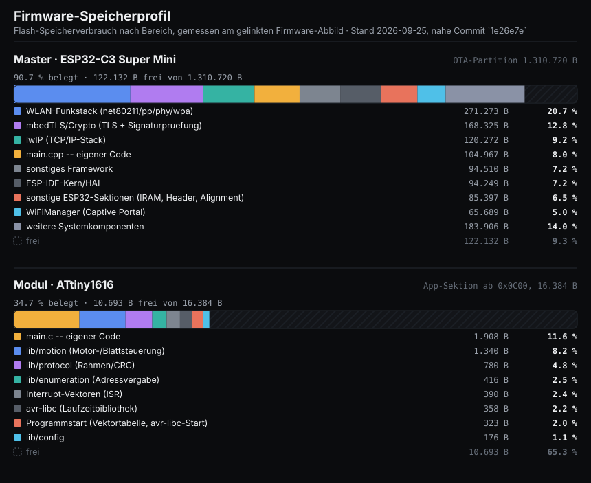

# firmware/

Master- und Modul-Firmware der KRONE-REW-Ersatzsteuerung. Details je Ziel:
[`master/README.md`](master/README.md) (ESP32-C3), [`module/README.md`](module/README.md)
(ATtiny1616). Gemeinsame Versionsnummer + Historie: [`CHANGELOG.md`](CHANGELOG.md).

## Speicherprofil



Aufschlüsselung des Flash-Speicherverbrauchs nach Bereich (Web-UI/eigener Code,
WLAN-Stack, Krypto/TLS, Motor-/Enumerations-Logik, ...), gemessen am jeweils
gelinkten Firmware-Abbild (`firmware.map` bzw. `avr-nm --size-sort` gegen die
ELF-Datei). Die Modul-Zahlen stammen aus einem einmaligen Analyse-Build ohne
`-flto` (damit Funktionsgrenzen als eigene Symbole sichtbar bleiben) -- das
ausgelieferte Abbild wird weiterhin mit `-flto` gebaut und ist ein paar Bytes
kleiner.

Neu erzeugen nach jeder Firmware-Änderung:

```bash
python tools/gen_firmware_memory_chart.py
```

(Siehe CLAUDE.md Arbeitsweise -- gehört zu den nach jeder Firmware-Änderung neu
zu erzeugenden Dateien, wie `prebuilt/`.)
