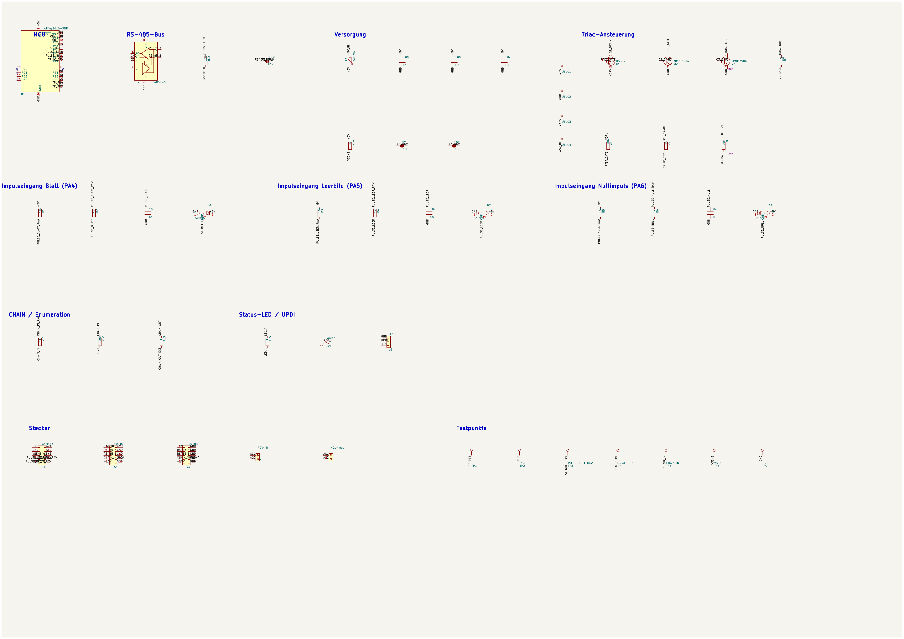
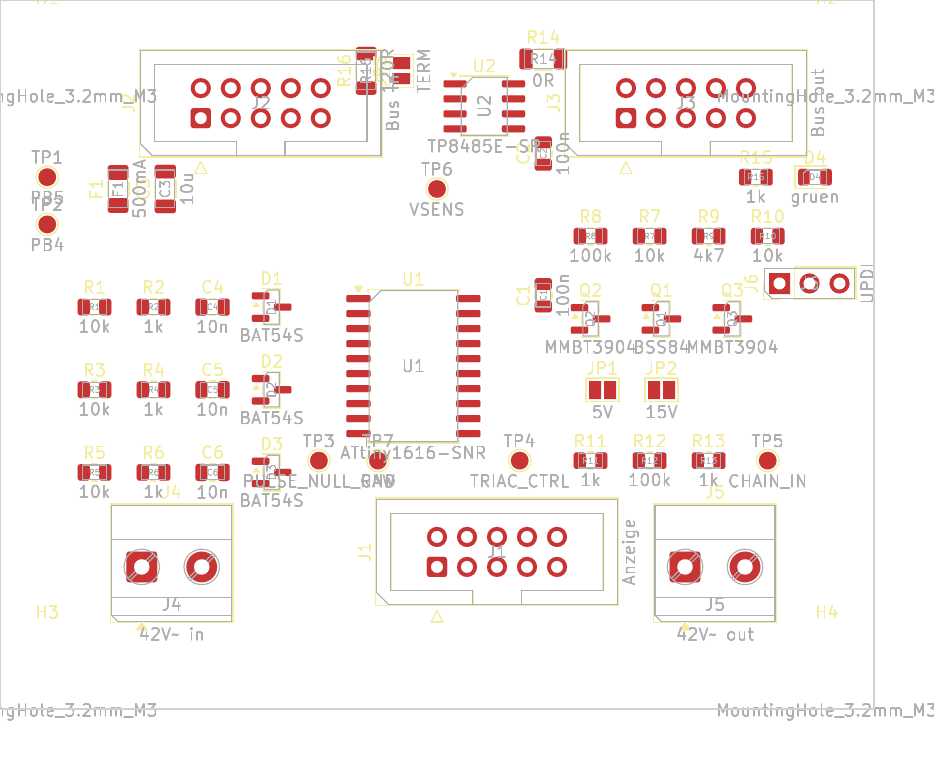

# hardware/daughtercard

KiCad-Projekt der Modulsteuerung (eine je Anzeigenmodul).
**Stand:** geroutet (2 Lagen, DRC 0 Fehler), Fertigungspaket committet unter
`manufacturing/`, bei JLCPCB in Auftrag.

## Schnellcheck





Vollauflösung: [`docs/daughtercard.pdf`](../../docs/daughtercard.pdf) ·
ERC: 0 Fehler / 0 Warnungen (`gen_daughtercard_sch.py --erc`, in der CI geprüft)

## Dateien

| Datei | Herkunft |
|---|---|
| `symbols/krone.kicad_sym` | **generiert** von `tools/build_krone_symbols.py` aus der KiCad-9-Bibliothek. Alle 15 im Schaltplan verwendeten Symbole, abgeflacht. Nicht von Hand bearbeiten. |
| `sym-lib-table` | projektlokale Bibliothekstabelle, bindet `krone` über `${KIPRJMOD}` ein |
| `daughtercard.kicad_sch` | **generiert** von `tools/gen_daughtercard_sch.py` aus Netzliste (`docs/schaltplan-daughtercard.md` Kap. 6) und Footprint-Tabelle (T5) |
| `daughtercard.kicad_pro` | Projektfile: projektlokale `sym-lib-table` + Netzklassen (AC, RS485, Power) aus Schaltplan Kap. 8.2 |
| `daughtercard.kicad_pcb` | **Erstplatzierung** von `tools/gen_daughtercard_pcb.py` (System-Python, `pcbnew`), danach vom Betreiber feinjustiert und mit `tools/route_daughtercard.py` (FreeRouting + `finish_routes.py` + Masseflächen) verdrahtet. Maker-Mark / schwarz-weiß-Lagenaufbau von `tools/add_silk_marks.py`. |
| `manufacturing/` | committetes Fertigungspaket (Gerber, Bohrdatei, Zip, BOM, CPL, README) von `tools/gen_manufacturing.py`. |
| `daughtercard.net` | **generiert** (`--netlist`), nicht versioniert. PCB-Netzliste. |

## Neu erzeugen

```bash
source .venv/bin/activate
python tools/build_krone_symbols.py                            # nur bei Änderung der Symbolauswahl
python tools/gen_daughtercard_sch.py --erc --pdf --png --netlist
```

**Vorsicht bei der `.kicad_pcb`:** Die Generatoren vergeben bei jedem Lauf neue
UUIDs. Solange die Platine noch nicht platziert/geroutet ist, gilt: `.kicad_sch`
+ `.kicad_pcb` nach einer Netzlistenänderung gemeinsam neu erzeugen und committen.
**Sobald die `.kicad_pcb` platziert/geroutet ist** (aktueller Stand), wird sie
**nicht** neu erzeugt — eine Netzlistenänderung erfordert stattdessen ein
UUID-Remapping der Footprint-Pfade (siehe Commit „F1 → 0-Ω-Brücke") und danach
`tools/route_daughtercard.py`. Details: `docs/layout-daughtercard.md`.

| Flag | Ausgabe |
|---|---|
| `--erc` | `docs/erc-daughtercard.rpt` |
| `--pdf` | `docs/daughtercard.pdf` |
| `--png` | `docs/daughtercard.png` (Vorschau ohne Rahmen, für GitHub) |
| `--netlist` | `daughtercard.net` (PCB-Netzliste, nicht versioniert) |

`--check-only` (bzw. `--check` bei `build_krone_symbols.py`) prüft ohne zu schreiben —
für die CI (T10). Der Check umfasst: jeder Pin an genau einem Netz oder NC, jedes
Bauteil mit vorhandenem Footprint.

Netznamen tragen im Netlist-Export das KiCad-übliche Wurzelblatt-Präfix (`/+5V`,
`/GND` …), weil die Rails über lokale Labels laufen. Für den PCB-Import ist das
unerheblich; wer es ohne Präfix will, stellt die Rails auf Power-Symbole um.

## Zum Schaltplan

Die Verbindungen werden über **gleichnamige lokale Labels an den Pins** hergestellt,
nicht über gezeichnete Leitungen. Die Bauteile liegen in einem groben Raster, nicht
handverlegt. Das ist bewusst so:

- Die menschenlesbare Darstellung der Schaltung ist `docs/schaltplan-daughtercard.md`
  Kapitel 5 (Prinzipschaltbilder) und Kapitel 6 (verbindliche Netzliste).
- Die `.kicad_sch` ist das maschinell erzeugte Abbild von Kapitel 6 für ERC,
  Netzlistenexport und – nach dem Footprint-Schritt T5 – das Layout.

Eine handverlegte, ablesbare Schaltplanseite kann später folgen; sie ist nicht
Teil von T4.

## Layout (T5) und Routing

Footprints sind allen 48 Bauteilen zugeordnet (`FOOTPRINTS` in
`tools/gen_daughtercard_sch.py`). Die Platine ist geroutet — Zonen, Netzklassen
(alle Bahnen 0,5 mm außer AC 1,5 mm), Masseflächen und die offenen Punkte mit
Layoutbezug stehen in [`docs/layout-daughtercard.md`](../../docs/layout-daughtercard.md),
die JLCPCB-Bestückung in [`docs/jlc-bestueckung.md`](../../docs/jlc-bestueckung.md).

## Prüfpunkte

Die zwei Netzlisten-Entscheidungen aus T4 (P-1 Testpads, P-2 BAT54S) sind vom
Betreiber freigegeben, siehe [`docs/pruefpunkte-t4.md`](../../docs/pruefpunkte-t4.md).
