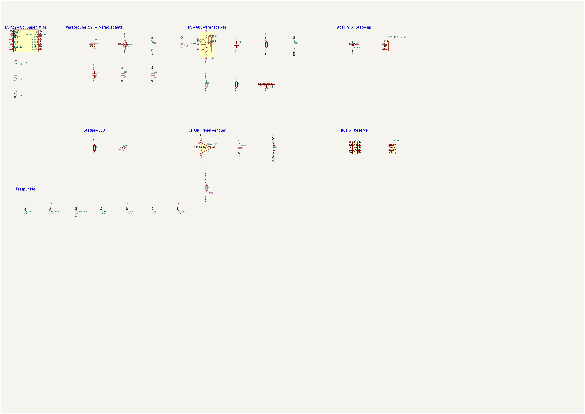
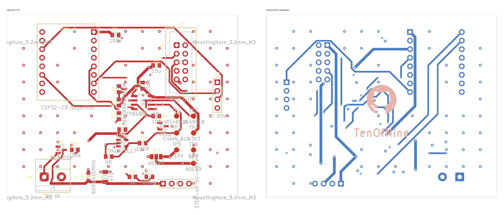
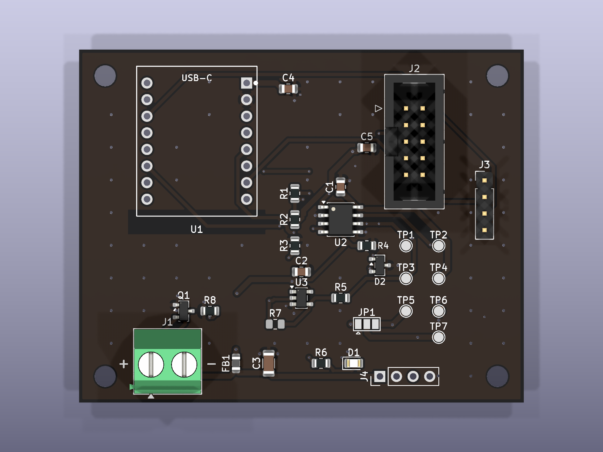
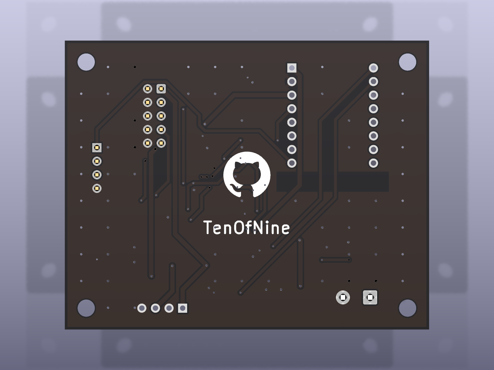

# hardware/master

KiCad-Projekt der Zentralsteuerung (RS-485-Master, eine je Anlage).
**Stand:** Rev. 0.2 **fertig** — geroutet + GUI-Feinlayout (2 Lagen, ERC 0/0,
DRC 0/0/0), Symbolprüfung freigegeben, Fertigungspaket committet unter
`manufacturing/`. **Bereit zur Bestellung.** Rev. 0.2 = Eingangsschutz
(Verpol-P-FET Q1 + R8, RS-485-TVS D2) + Silk (+/- an J1, „ANT"-Text raus,
Referenztexte U2/D2/R4 am Bauteil). Die `master.kicad_pcb` ist der finale
Stand des Betreibers — nicht mehr per Skript regenerieren.

## Schnellcheck





3D-Vorschau (`tools/gen_master_pcb.py --render`):

| Oberseite | Unterseite |
|---|---|
|  |  |

Vollauflösung Schaltplan: [`docs/master.pdf`](../../docs/master.pdf) ·
ERC: 0 Fehler / 0 Warnungen (`gen_master_sch.py --erc`, in der CI geprüft) ·
DRC: 0 Fehler / 0 Warnungen / 0 unverdrahtet (Rev. 0.2). Feinlayout im GUI
(Bahnführung, Bestückungsdruck) ist Sache des Betreibers.

## Dateien

| Datei | Herkunft |
|---|---|
| `symbols/krone_master.kicad_sym` | **generiert** von `tools/build_krone_master_symbols.py`. Die 13 im Schaltplan verwendeten Symbole: Standardteile abgeflacht aus der KiCad-9-Bibliothek, `TP8485E-SR` wie bei der Daughter Card zusammengesetzt, `ESP32-C3-SuperMini` (16-Pin-Modul, 2×8) von Hand. Nicht bearbeiten. |
| `sym-lib-table` | projektlokale Bibliothekstabelle, bindet `krone_master` über `${KIPRJMOD}` ein |
| `footprints/logos.pretty/` | GitHub-Marke für die Rückseiten-Silkscreen (projektlokal, wie bei der Daughter Card) |
| `footprints/modules.pretty/` | `ESP32-C3-SuperMini.kicad_mod` — 2×8-THT für Buchsenleisten, Reihenabstand 15,24 mm, Pad 1 = 5V rechts oben, Antennen-Keepout an der Unterkante. Von Hand erstellt (kein Standard-Footprint). |
| `fp-lib-table` | projektlokale Footprint-Tabelle für die beiden `.pretty`-Ordner |
| `master.kicad_sch` | **generiert** von `tools/gen_master_sch.py` aus Netzliste (`docs/schaltplan-master.md` Kap. 6) und Footprint-Tabelle. 32 Bauteile, 20 Netze. |
| `master.kicad_pro` | Projektfile: projektlokale `sym-lib-table` / `fp-lib-table` + Netzklassen (Default, Power, GND — **kein AC**) aus Schaltplan Kap. 8 |
| `master.kicad_pcb` | Rev. 0.1: **Erstplatzierung** `tools/gen_master_pcb.py` + FreeRouting (`route_master.py`). Rev. 0.2 (Q1/R8/D2): **inkrementell** mit `tools/patch_master_pcb.py` in die geroutete Rev-0.1-Platine eingesetzt und mit `finish_routes.py` geschlossen (FreeRouting 2.3.0 hängt hier reproduzierbar). Maker-Mark / schwarz-weiß-Lagenaufbau von `tools/add_silk_marks.py --board …`. DRC 0/0. |
| `manufacturing/` | committetes Fertigungspaket (Gerber, Bohrdatei, Zip, BOM, CPL, README) von `tools/gen_master_manufacturing.py`. |
| `master.net` | **generiert** (`--netlist`), nicht versioniert. PCB-Netzliste. |

## Neu erzeugen

```bash
source .venv/bin/activate
python tools/build_krone_master_symbols.py                          # nur bei Änderung der Symbolauswahl
xvfb-run -a python tools/gen_master_sch.py --erc --pdf --png --netlist
```

**Vorsicht bei der `.kicad_pcb`:** Die Generatoren vergeben bei jedem Lauf neue
UUIDs. Solange die Platine noch nicht platziert/geroutet ist, gilt: `.kicad_sch`
+ `.kicad_pcb` nach einer Netzlistenänderung gemeinsam neu erzeugen und committen.
**Sobald die `.kicad_pcb` geroutet ist** (aktueller Stand), wird sie **nicht**
neu erzeugt — `tools/gen_master_pcb.py` verweigert den Neubau, wenn Bahnen oder
Zonen vorhanden sind (`--force`-Schutz). Eine Netzlistenänderung erfordert
stattdessen ein UUID-Remapping der Footprint-Pfade und danach
`tools/route_master.py`. Details: `docs/layout-master.md`.

| Flag (`gen_master_sch.py`) | Ausgabe |
|---|---|
| `--erc` | `docs/erc-master.rpt` |
| `--pdf` | `docs/master.pdf` |
| `--png` | `docs/master.png` (Vorschau ohne Rahmen, für GitHub) |
| `--netlist` | `master.net` (PCB-Netzliste, nicht versioniert) |

`--check-only` (bzw. `--check` bei `build_krone_master_symbols.py`) prüft ohne zu
schreiben — für die CI (T10). Der Check umfasst: jeder Pin an genau einem Netz
oder NC, jedes Bauteil mit vorhandenem Footprint.

Netznamen tragen im Netlist-Export das KiCad-übliche Wurzelblatt-Präfix (`/+5V`,
`/GND` …), weil die Rails über lokale Labels laufen. Für den PCB-Import ist das
unerheblich.

## Zum Schaltplan

Die Verbindungen werden über **gleichnamige lokale Labels an den Pins** hergestellt,
nicht über gezeichnete Leitungen. Die Bauteile liegen in einem groben Raster, nicht
handverlegt. Das ist bewusst so:

- Die menschenlesbare Darstellung der Schaltung ist `docs/schaltplan-master.md`
  Kapitel 5 (Prinzipschaltbilder) und Kapitel 6 (verbindliche Netzliste).
- Die `.kicad_sch` ist das maschinell erzeugte Abbild von Kapitel 6 für ERC,
  Netzlistenexport und das Layout.

## Layout und Routing

Footprints sind allen 32 Bauteilen zugeordnet (`FOOTPRINTS` in
`tools/gen_master_sch.py`). Die Platine ist geroutet — Erstplatzierung, Zonen,
Netzklassen (alle Bahnen 0,5 mm, Power `+5V(_RAW/_IN)`/`+3V3`/`+15V`/`ADER9`
0,8 mm mit 0,8-mm-Vias), Masseflächen F.Cu + B.Cu mit 5-mm-Stitching und die
offenen Punkte mit Layoutbezug stehen in
[`docs/layout-master.md`](../../docs/layout-master.md).
Die Massefläche ist nur im Antennenbereich unter U1 ausgespart (Footprint-Keepout).
Die JLCPCB-Bestückung beschreibt [`manufacturing/README.md`](manufacturing/README.md):
18 SMD-Teile (0805 / SOIC-8 / SOT-23 / SOT-23-5), alle LCSC-Basic; J1–J4,
U1-Sockel und JP1 von Hand.

## Prüfpunkte

`docs/symbolpruefung-master.md` ist vom Betreiber **freigegeben** (01.09.2026):
74LVC1G17 gegen Nexperia Rev. 16.1 §6.1, ESP32-C3-Modul-Pinbelegung und
Einbaulage aus den Betreiberfotos, TP8485E per Verweis. **Rev. 0.2 nachgetragen,
Freigabe offen:** AO3401A (SOT-23 1=G/2=S/3=D) und SM712 (Pin 3 = GND, gegen
Bourns-CDSOT23-SM712-Datenblatt).

Offen (blockieren die Fertigung nicht bzw. sind vor der Bestellung zu klären):

| Nr | Punkt | Wirkung |
|---|---|---|
| M-2 | Aufwärtswandler-IC + Pinbelegung | Boost-Steckplatz J4 bleibt DNP, bis O-2 gemessen ist |
| M-3 | CHAIN 3,3 V → 5 V | **entschieden:** U3 wird bestückt, R7 (0 Ω) DNP-Reserveplatz |
| M-4 | RS-485-TVS D2 (SM712/PSM712) | Pinbelegung gegen Bourns-Datenblatt geprüft; ProTek-Spot-Check + Freigabe vor Bestellung |
| O-2 | 5 V oder 12–20 V an Anzeige-Pin 9 | ob JP1 auf +15 V steht und der Boost bestückt wird |
